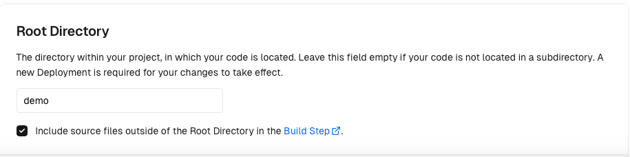
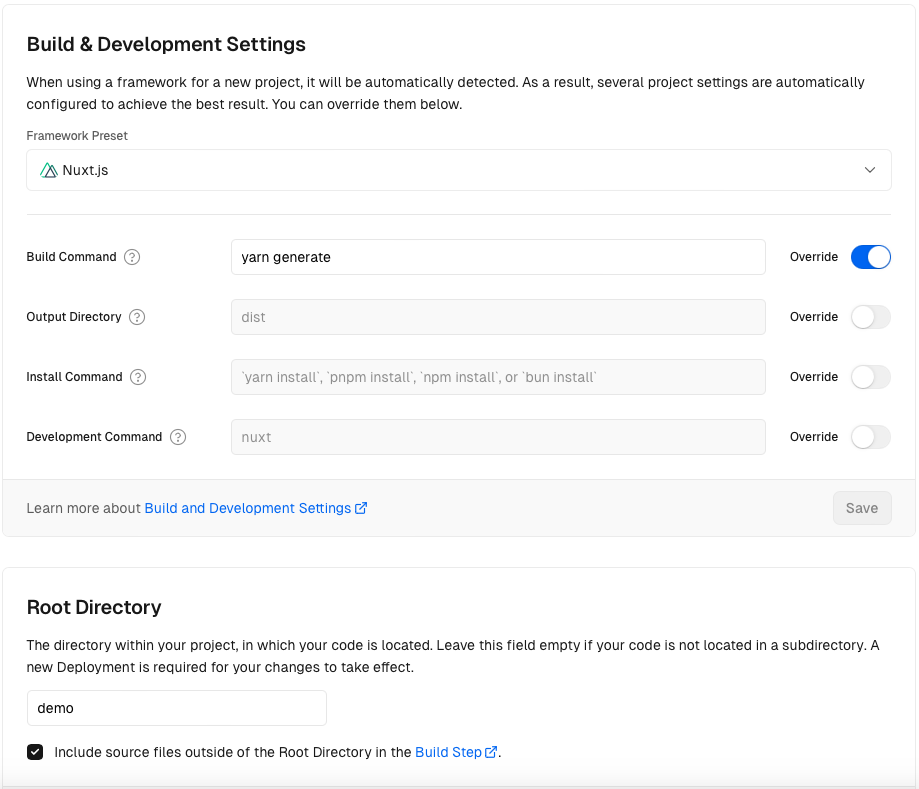

## Demo

This demo deploys the Documentation section with the Nuxt-Security module protection.

### Deploying on Vercel

Setup your Vercel Project Settings depending on whether you want an SSR deployment or an SSG deployment:

#### SSR

1. Set **Root Directory** field to `demo`

#### SSG

1. Set **Root Directory** field to `demo`
2. Override **Build Command** field to `yarn generate`

### Pre-deployed Examples

You can navigate to the following links to see it live in action 🚀

https://secure-docs-ssr.vercel.app/

https://secure-docs-ssg.vercel.app/

Open your browser devtools to inspect the Nuxt Security headers.